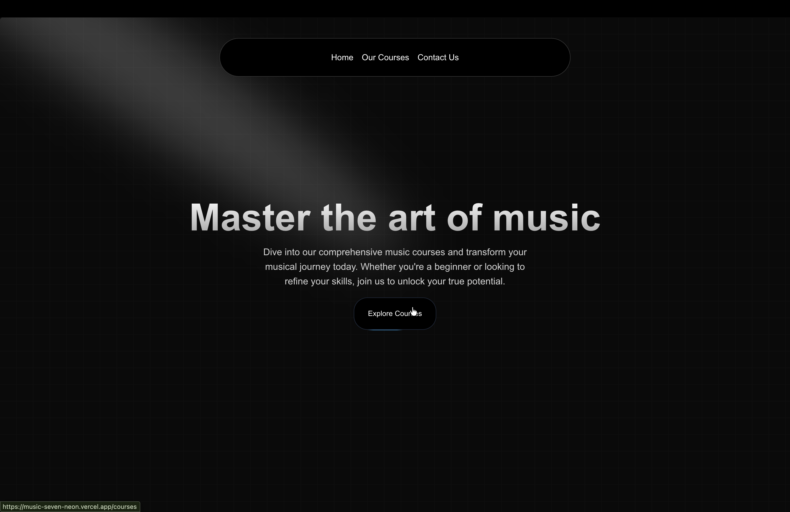
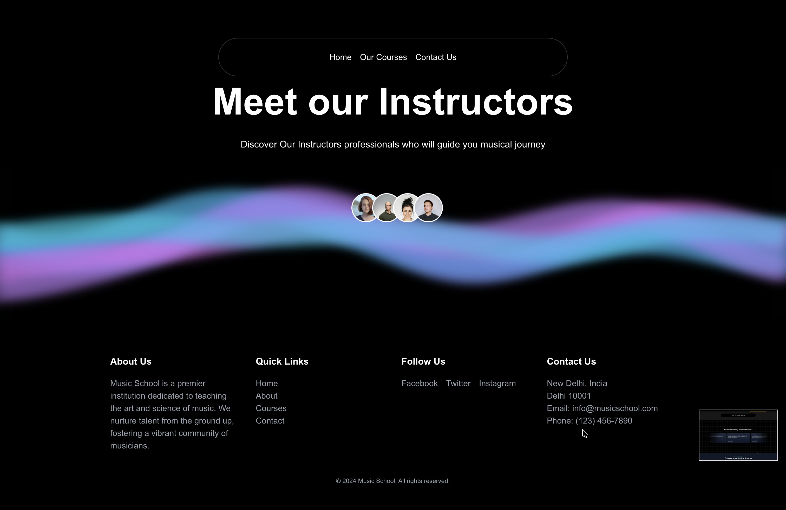
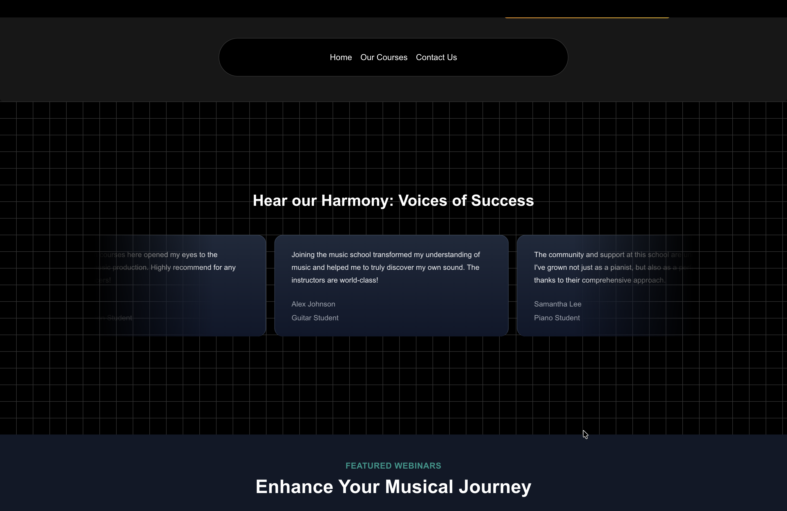

# 🎵 Music School Website

A modern, elegant music school website built with Next.js, featuring a sleek dark theme with vibrant gradient accents. This platform showcases music courses, instructors, and student testimonials with a professional and engaging user interface.


## 🌐 Live Demo

**Visit the live website:** [https://music-seven-neon.vercel.app/courses](https://music-seven-neon.vercel.app/courses)

## 📸 Screenshots

### Home Page


### Instructors & Footer


### Testimonials


## ✨ Features

- **Modern Design**: Sleek dark theme with vibrant purple-blue gradient accents
- **Responsive Layout**: Fully responsive design that works seamlessly across all devices
- **Course Showcase**: Comprehensive display of available music courses
- **Instructor Profiles**: Meet the talented professionals who guide students
- **Student Testimonials**: Real feedback from students showcasing their success stories
- **Interactive UI**: Smooth animations and transitions for enhanced user experience
- **Fast Performance**: Built with Next.js for optimal loading speeds and SEO
- **Featured Webinars**: Dedicated section for educational webinars

## 🛠️ Tech Stack

- **Framework**: [Next.js](https://nextjs.org/) - React framework for production
- **Language**: [TypeScript](https://www.typescriptlang.org/) - Type-safe JavaScript
- **Styling**: [Tailwind CSS](https://tailwindcss.com/) - Utility-first CSS framework
- **Deployment**: [Vercel](https://vercel.com/) - Optimized hosting platform
- **UI Components**: Custom React components with modern design patterns

## 📋 Prerequisites

Before running this project, make sure you have:

- Node.js (v18 or higher)
- npm, yarn, or pnpm package manager
- Git for version control

## 🚀 Getting Started

### Installation

1. **Clone the repository**
   ```bash
   git clone https://github.com/Tushar8466/music.git
   cd music
   ```

2. **Install dependencies**
   ```bash
   npm install
   # or
   yarn install
   # or
   pnpm install
   ```

3. **Run the development server**
   ```bash
   npm run dev
   # or
   yarn dev
   # or
   pnpm dev
   ```

4. **Open your browser**
   
   Navigate to [http://localhost:3000](http://localhost:3000) to see the website in action.

## 🎨 Key Pages

- **Home** (`/`): Landing page with hero section featuring the main value proposition
- **Courses** (`/courses`): Comprehensive list of available music courses
- **Our Instructors**: Profiles of experienced music professionals
- **Contact Us**: Contact information and inquiry form
- **Testimonials**: Success stories from students

## 🌟 Key Features Breakdown

### Hero Section
- Compelling headline: "Master the art of music"
- Clear call-to-action with "Explore Courses" button
- Elegant gradient background with smooth animations

### Instructor Showcase
- "Meet our Instructors" section with professional profiles
- Circular avatar grid displaying instructor photos
- Eye-catching purple-blue gradient wave design

### Student Testimonials
- "Hear our Harmony: Voices of Success" section
- Card-based layout featuring student feedback
- Real experiences from Guitar Students, Piano Students, and more

### Footer
- Quick navigation links
- Social media integration (Facebook, Twitter, Instagram)
- Contact information with location (New Delhi, India)
- Professional branding and copyright information

## 🔧 Configuration

### Environment Variables

Create a `.env.local` file in the root directory (if needed):

```env
NEXT_PUBLIC_SITE_URL=https://music-seven-neon.vercel.app
# Add other environment variables as needed
```

## 📦 Build for Production

```bash
npm run build
# or
yarn build
# or
pnpm build
```

The optimized production build will be created in the `.next` folder.

## 🚢 Deployment

This project is configured for easy deployment on Vercel:

1. Push your code to GitHub
2. Import your repository on [Vercel](https://vercel.com)
3. Vercel will automatically detect Next.js and configure the build settings
4. Deploy!

Alternatively, you can deploy using the Vercel CLI:

```bash
npm install -g vercel
vercel
```

## 🤝 Contributing

Contributions are welcome! If you'd like to improve this project:

1. Fork the repository
2. Create your feature branch (`git checkout -b feature/AmazingFeature`)
3. Commit your changes (`git commit -m 'Add some AmazingFeature'`)
4. Push to the branch (`git push origin feature/AmazingFeature`)
5. Open a Pull Request

## 📄 License

This project is open source and available under the [MIT License](LICENSE).

## 👨‍💻 Author

**Tushar**
- GitHub: [@Tushar8466](https://github.com/Tushar8466)

## 📞 Contact

For any inquiries or support, please reach out:

- **Email**: info@musicschool.com
- **Phone**: (123) 456-7890
- **Location**: New Delhi, India, Delhi 10001

## 🙏 Acknowledgments

- Design inspiration from modern educational platforms
- Next.js and Vercel teams for excellent documentation
- Tailwind CSS for the utility-first CSS framework
- All contributors and supporters of this project

---

⭐ **If you find this project helpful, please consider giving it a star on GitHub!** ⭐

Built with ❤️ using Next.js and Tailwind CSS
